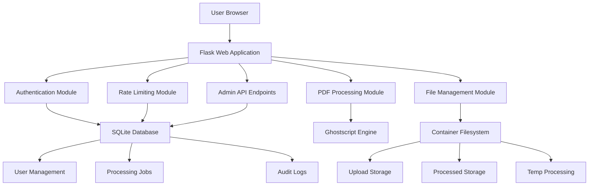
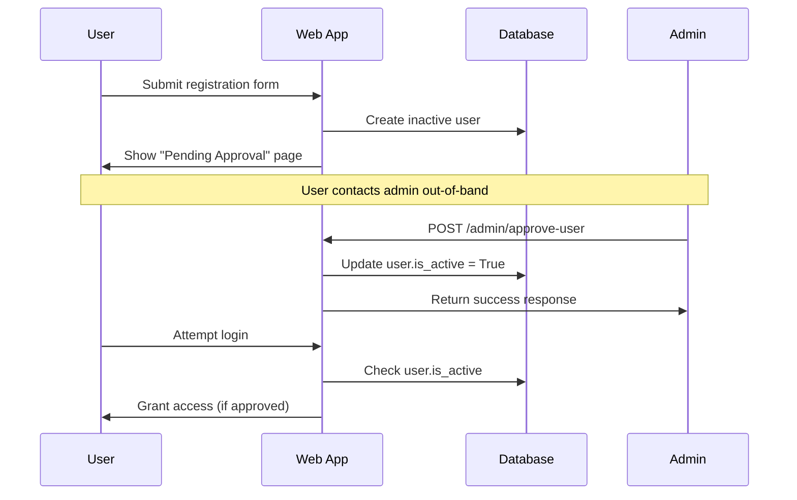
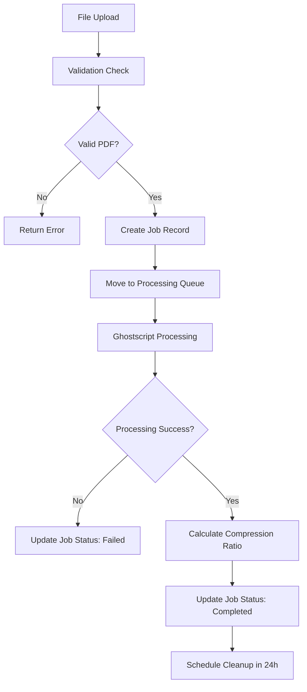

# PDF Quality Reduction Web Application - Architecture Document

## Executive Summary

This document outlines the complete architecture and technical specifications for a minimal PDF quality reduction web application built with Python Flask, designed to serve fewer than 10 users with deployment on Google Cloud Run.

## System Requirements Analysis

Based on requirements gathering, the following constraints and recommendations have been established:

### Technical Constraints
- **Backend**: Python Flask with Flask-SQLAlchemy ORM
- **Database**: SQLite for simplicity
- **Frontend**: Jinja2 templates with TailwindCSS
- **Authentication**: Basic registration with admin API approval
- **PDF Processing**: Ghostscript (recommended for superior compression)
- **File Size Limit**: 25MB per file
- **Session Quota**: 100MB bulk processing per session
- **User Base**: <10 people with 3 concurrent users maximum
- **Container**: Docker optimized for Google Cloud Run
- **Storage**: Container filesystem with intelligent cleanup

### Recommended Rate Limits
- **Files per day**: 50 files per user
- **Storage per day**: 200MB total per user
- **Session storage**: 100MB (clearable for continued work)
- **Concurrent uploads**: 3 files simultaneously

## System Architecture Overview



### Component Separation

1. **Web Layer**: Flask routes, templates, static files
2. **Authentication Layer**: User registration, login, admin approval
3. **Processing Layer**: PDF compression with quality presets
4. **Data Layer**: SQLite database with SQLAlchemy ORM
5. **File Management Layer**: Upload, processing, and cleanup
6. **Security Layer**: Rate limiting, input validation, CSRF protection

## Project Directory Structure

```
pdf-compressor/
├── app/
│   ├── __init__.py                 # Flask app factory
│   ├── config.py                   # Configuration settings
│   ├── models/
│   │   ├── __init__.py
│   │   ├── user.py                 # User model
│   │   ├── job.py                  # Processing job model
│   │   └── audit.py                # Audit log model
│   ├── auth/
│   │   ├── __init__.py
│   │   ├── routes.py               # Authentication routes
│   │   ├── forms.py                # WTForms for auth
│   │   └── utils.py                # Auth utilities
│   ├── main/
│   │   ├── __init__.py
│   │   ├── routes.py               # Main application routes
│   │   ├── forms.py                # Upload and processing forms
│   │   └── utils.py                # Main utilities
│   ├── admin/
│   │   ├── __init__.py
│   │   ├── routes.py               # Admin API routes
│   │   └── utils.py                # Admin utilities
│   ├── processing/
│   │   ├── __init__.py
│   │   ├── pdf_processor.py        # PDF compression logic
│   │   ├── quality_presets.py      # Compression presets
│   │   └── job_manager.py          # Job queue management
│   ├── utils/
│   │   ├── __init__.py
│   │   ├── file_handler.py         # File operations
│   │   ├── rate_limiter.py         # Rate limiting logic
│   │   ├── cleanup.py              # File cleanup utilities
│   │   └── validators.py           # Input validation
│   ├── static/
│   │   ├── css/
│   │   │   └── tailwind.css        # TailwindCSS styles
│   │   ├── js/
│   │   │   ├── upload.js           # Upload handling
│   │   │   ├── progress.js         # Progress tracking
│   │   │   └── session.js          # Session management
│   │   └── images/
│   │       └── favicon.ico
│   └── templates/
│       ├── base.html               # Base template
│       ├── auth/
│       │   ├── login.html
│       │   ├── register.html
│       │   └── pending.html        # Approval pending
│       ├── main/
│       │   ├── index.html          # Dashboard
│       │   ├── upload.html         # Upload interface
│       │   ├── processing.html     # Processing status
│       │   └── history.html        # Job history
│       └── errors/
│           ├── 404.html
│           ├── 413.html            # File too large
│           └── 500.html
├── migrations/                     # Database migrations
├── storage/
│   ├── uploads/                    # Uploaded files (temp)
│   ├── processed/                  # Processed files (temp)
│   └── temp/                       # Processing workspace
├── tests/
│   ├── __init__.py
│   ├── test_auth.py
│   ├── test_processing.py
│   ├── test_admin.py
│   └── test_utils.py
├── docker/
│   ├── Dockerfile
│   ├── Dockerfile.prod
│   └── entrypoint.sh
├── deployment/
│   ├── cloudbuild.yaml
│   ├── service.yaml
│   └── env-template.yaml
├── requirements.txt
├── requirements-dev.txt
├── run.py                          # Application entry point
├── .env.example
├── .dockerignore
├── .gitignore
└── README.md
```

## Database Schema Design

### User Model (`app/models/user.py`)

```python
class User(UserMixin, db.Model):
    id = db.Column(db.Integer, primary_key=True)
    email = db.Column(db.String(120), unique=True, nullable=False, index=True)
    password_hash = db.Column(db.String(255), nullable=False)
    full_name = db.Column(db.String(100), nullable=False)
    is_active = db.Column(db.Boolean, default=False, nullable=False)
    is_admin = db.Column(db.Boolean, default=False, nullable=False)
    created_at = db.Column(db.DateTime, default=datetime.utcnow, nullable=False)
    approved_at = db.Column(db.DateTime, nullable=True)
    approved_by = db.Column(db.Integer, db.ForeignKey('user.id'), nullable=True)
    last_login = db.Column(db.DateTime, nullable=True)
    
    # Rate limiting fields
    daily_file_count = db.Column(db.Integer, default=0, nullable=False)
    daily_storage_used = db.Column(db.BigInteger, default=0, nullable=False)  # bytes
    session_storage_used = db.Column(db.BigInteger, default=0, nullable=False)  # bytes
    last_reset_date = db.Column(db.Date, default=date.today, nullable=False)
    
    # Relationships
    processing_jobs = db.relationship('ProcessingJob', backref='user', lazy='dynamic')
    audit_logs = db.relationship('AuditLog', backref='user', lazy='dynamic')
```

### Processing Job Model (`app/models/job.py`)

```python
class ProcessingJob(db.Model):
    id = db.Column(db.Integer, primary_key=True)
    user_id = db.Column(db.Integer, db.ForeignKey('user.id'), nullable=False)
    
    # File information
    original_filename = db.Column(db.String(255), nullable=False)
    processed_filename = db.Column(db.String(255), nullable=True)
    original_size = db.Column(db.BigInteger, nullable=False)  # bytes
    processed_size = db.Column(db.BigInteger, nullable=True)  # bytes
    compression_ratio = db.Column(db.Float, nullable=True)
    
    # Processing details
    quality_preset = db.Column(db.String(20), nullable=False)  # high, medium, low
    status = db.Column(db.String(20), default='pending', nullable=False)
    # Status: pending, processing, completed, failed, expired
    
    # Timestamps
    created_at = db.Column(db.DateTime, default=datetime.utcnow, nullable=False)
    started_at = db.Column(db.DateTime, nullable=True)
    completed_at = db.Column(db.DateTime, nullable=True)
    expires_at = db.Column(db.DateTime, nullable=False)  # 24 hours from creation
    
    # Error handling
    error_message = db.Column(db.Text, nullable=True)
    retry_count = db.Column(db.Integer, default=0, nullable=False)
    
    # File paths (relative to storage directory)
    upload_path = db.Column(db.String(500), nullable=False)
    processed_path = db.Column(db.String(500), nullable=True)
    
    @property
    def is_expired(self):
        return datetime.utcnow() > self.expires_at
        
    @property
    def time_remaining(self):
        if self.is_expired:
            return timedelta(0)
        return self.expires_at - datetime.utcnow()
```

### Audit Log Model (`app/models/audit.py`)

```python
class AuditLog(db.Model):
    id = db.Column(db.Integer, primary_key=True)
    user_id = db.Column(db.Integer, db.ForeignKey('user.id'), nullable=True)
    
    # Action details
    action = db.Column(db.String(50), nullable=False)
    # Actions: login, logout, upload, process, download, admin_approve, etc.
    resource_type = db.Column(db.String(50), nullable=True)  # file, user, job
    resource_id = db.Column(db.String(100), nullable=True)
    
    # Request details
    ip_address = db.Column(db.String(45), nullable=False)  # IPv6 support
    user_agent = db.Column(db.String(500), nullable=True)
    
    # Additional context
    details = db.Column(db.JSON, nullable=True)  # Flexible JSON for extra data
    
    # Timestamp
    created_at = db.Column(db.DateTime, default=datetime.utcnow, nullable=False)
    
    @staticmethod
    def log_action(user_id, action, ip_address, resource_type=None, 
                   resource_id=None, user_agent=None, **details):
        log = AuditLog(
            user_id=user_id,
            action=action,
            resource_type=resource_type,
            resource_id=resource_id,
            ip_address=ip_address,
            user_agent=user_agent,
            details=details if details else None
        )
        db.session.add(log)
        db.session.commit()
```

## Authentication and Authorization Flow

### Registration and Approval Process



### Authentication Endpoints

1. **User Registration**: `POST /auth/register`
2. **User Login**: `POST /auth/login`
3. **User Logout**: `POST /auth/logout`
4. **Admin Approval**: `POST /admin/approve-user`
5. **Admin User List**: `GET /admin/pending-users`

### Session Management

- Flask-Login for session management
- 24-hour session timeout
- Secure session cookies with httpOnly and secure flags
- CSRF protection on all forms

## PDF Processing Pipeline Design

### Quality Presets Configuration (`app/processing/quality_presets.py`)

```python
QUALITY_PRESETS = {
    'high': {
        'name': 'High Quality',
        'description': 'Minimal compression, best quality',
        'ghostscript_args': [
            '-dPDFSETTINGS=/printer',
            '-dColorImageResolution=300',
            '-dGrayImageResolution=300',
            '-dMonoImageResolution=1200',
        ],
        'expected_compression': 0.7  # 30% reduction
    },
    'medium': {
        'name': 'Medium Quality',
        'description': 'Balanced compression and quality',
        'ghostscript_args': [
            '-dPDFSETTINGS=/ebook',
            '-dColorImageResolution=150',
            '-dGrayImageResolution=150',
            '-dMonoImageResolution=600',
        ],
        'expected_compression': 0.4  # 60% reduction
    },
    'low': {
        'name': 'Low Quality',
        'description': 'Maximum compression, smallest size',
        'ghostscript_args': [
            '-dPDFSETTINGS=/screen',
            '-dColorImageResolution=72',
            '-dGrayImageResolution=72',
            '-dMonoImageResolution=300',
        ],
        'expected_compression': 0.2  # 80% reduction
    }
}
```

### Processing Workflow



### Processing Engine (`app/processing/pdf_processor.py`)

Key components:
- **Ghostscript Integration**: Subprocess calls with timeout protection
- **Progress Tracking**: Real-time status updates
- **Error Handling**: Comprehensive error capture and reporting
- **Resource Management**: Memory and CPU usage monitoring
- **Quality Validation**: Post-processing integrity checks

## API Endpoints Specification

### Authentication Endpoints

#### POST /auth/register
```json
Request:
{
    "email": "user@example.com",
    "password": "securepassword",
    "full_name": "John Doe"
}

Response:
{
    "success": true,
    "message": "Registration successful. Please wait for admin approval.",
    "user_id": 123
}
```

#### POST /auth/login
```json
Request:
{
    "email": "user@example.com",
    "password": "securepassword"
}

Response:
{
    "success": true,
    "message": "Login successful",
    "redirect_url": "/dashboard"
}
```

### Admin Endpoints

#### GET /admin/pending-users
```json
Response:
{
    "users": [
        {
            "id": 123,
            "email": "user@example.com",
            "full_name": "John Doe",
            "created_at": "2024-01-15T10:30:00Z"
        }
    ]
}
```

#### POST /admin/approve-user
```json
Request:
{
    "email": "user@example.com"
}

Response:
{
    "success": true,
    "message": "User approved successfully"
}
```

### Processing Endpoints

#### POST /upload
```json
Request: multipart/form-data
- file: PDF file (max 25MB)
- quality: "high"|"medium"|"low"

Response:
{
    "success": true,
    "job_id": 456,
    "message": "File uploaded successfully",
    "estimated_time": "2-3 minutes"
}
```

#### GET /job/{job_id}/status
```json
Response:
{
    "job_id": 456,
    "status": "processing",
    "progress": 75,
    "original_size": 5242880,
    "processed_size": 2097152,
    "compression_ratio": 0.4,
    "time_remaining": "00:23:45",
    "download_url": null
}
```

#### GET /download/{job_id}
- Returns processed PDF file
- Includes appropriate headers for download
- Validates user ownership and job completion

### User Dashboard Endpoints

#### GET /dashboard
Returns HTML dashboard with:
- Current session usage (files and storage)
- Active processing jobs
- Recent job history
- Available actions

#### GET /api/user/quota
```json
Response:
{
    "daily_limits": {
        "files": 50,
        "storage_mb": 200
    },
    "daily_usage": {
        "files": 12,
        "storage_mb": 45.2
    },
    "session_usage": {
        "files": 3,
        "storage_mb": 12.8
    }
}
```

## File Handling and Cleanup Mechanisms

### File Storage Strategy

1. **Upload Directory**: `/storage/uploads/{user_id}/{date}/`
2. **Processing Directory**: `/storage/temp/{job_id}/`
3. **Processed Directory**: `/storage/processed/{user_id}/{date}/`

### Cleanup Policies

1. **Automatic Cleanup**: Background task runs every hour
2. **File Expiration**: 24 hours after job completion
3. **Session Cleanup**: Option to clear current session files
4. **Failed Job Cleanup**: Immediate cleanup of failed processing attempts

### Storage Quota Management

```python
class StorageManager:
    def check_session_quota(self, user_id, additional_size):
        # Check if adding file would exceed 100MB session limit
        pass
    
    def clear_session_files(self, user_id):
        # Remove all current session files for user
        pass
    
    def get_storage_stats(self, user_id):
        # Return current usage statistics
        pass
```

## Security Considerations

### Input Validation
- **File Type Validation**: Magic byte checking for PDF files
- **File Size Limits**: 25MB maximum per file
- **Filename Sanitization**: Remove dangerous characters
- **PDF Content Validation**: Basic PDF structure verification

### Authentication Security
- **Password Hashing**: bcrypt with configurable rounds
- **Session Security**: Secure, httpOnly cookies
- **CSRF Protection**: Token-based protection on all forms
- **Rate Limiting**: Login attempt protection

### File Security
- **Path Traversal Protection**: Validate all file paths
- **Temporary File Cleanup**: Secure deletion of temp files
- **Access Control**: User isolation for file access
- **Virus Scanning**: Optional integration point for future enhancement

### API Security
- **Input Sanitization**: All user inputs validated
- **SQL Injection Protection**: SQLAlchemy ORM usage
- **XSS Protection**: Template auto-escaping
- **Admin API Authentication**: Separate admin token system

## Rate Limiting Strategy

### Implementation Approach
- **Database-based Tracking**: Store limits in user model
- **Daily Reset Logic**: Automatic daily counter reset
- **Session-based Limits**: 100MB per session with clear option
- **Graceful Degradation**: Informative error messages when limits exceeded

### Rate Limit Configuration
```python
RATE_LIMITS = {
    'files_per_day': 50,
    'storage_per_day_mb': 200,
    'session_storage_mb': 100,
    'concurrent_uploads': 3,
    'login_attempts_per_hour': 10
}
```

### Rate Limiting Flow
1. **Pre-upload Check**: Validate quotas before file processing
2. **Real-time Tracking**: Update counters on successful operations
3. **Daily Reset**: Midnight UTC reset of daily counters
4. **Session Management**: Track and allow clearing of session files

## Docker Containerization Design

### Multi-stage Dockerfile Strategy
```dockerfile
# Build stage for dependencies
FROM python:3.11-slim as builder
# ... dependency installation

# Production stage
FROM python:3.11-slim as production
# ... minimal runtime environment
```

### Container Optimization
- **Multi-stage Build**: Reduce final image size
- **Non-root User**: Security best practices
- **Ghostscript Integration**: Minimal ghostscript installation
- **Health Checks**: Container health monitoring
- **Signal Handling**: Graceful shutdown support

### Environment Configuration
- **Environment Variables**: All configuration via env vars
- **Secrets Management**: Google Secret Manager integration
- **Logging Configuration**: Structured JSON logging for Cloud Run

## Cloud Run Deployment Architecture

### Service Configuration
```yaml
apiVersion: serving.knative.dev/v1
kind: Service
metadata:
  name: pdf-compressor
  annotations:
    run.googleapis.com/ingress: all
spec:
  template:
    metadata:
      annotations:
        autoscaling.knative.dev/minScale: "0"
        autoscaling.knative.dev/maxScale: "10"
        run.googleapis.com/cpu-throttling: "false"
    spec:
      containerConcurrency: 10
      containers:
      - image: gcr.io/PROJECT_ID/pdf-compressor
        resources:
          limits:
            cpu: "2"
            memory: "2Gi"
        env:
        - name: FLASK_ENV
          value: "production"
```

### Resource Allocation
- **CPU**: 2 vCPUs for PDF processing
- **Memory**: 2GB for handling large files
- **Concurrency**: 10 requests per instance
- **Scaling**: 0-10 instances based on demand

### Persistent Storage
- **Database**: SQLite file mounted to Cloud Run volume
- **File Storage**: Container filesystem with cleanup policies
- **Backup Strategy**: Database backup to Cloud Storage (optional)

### Monitoring and Logging
- **Cloud Logging**: Structured application logs
- **Cloud Monitoring**: Custom metrics for processing jobs
- **Health Checks**: Application health endpoints
- **Error Reporting**: Cloud Error Reporting integration

## Performance Considerations

### Processing Optimization
- **Concurrent Processing**: Process multiple files simultaneously
- **Memory Management**: Stream processing for large files
- **CPU Utilization**: Efficient Ghostscript parameter tuning
- **Caching**: Cache compression settings and user data

### Database Optimization
- **Indexing Strategy**: Optimize queries with proper indexes
- **Connection Pooling**: SQLAlchemy connection management
- **Query Optimization**: Efficient data retrieval patterns
- **Cleanup Jobs**: Regular maintenance tasks

### Frontend Performance
- **Progress Tracking**: Real-time upload and processing updates
- **Responsive Design**: Mobile-friendly interface
- **Asset Optimization**: Minified CSS and JavaScript
- **Caching Headers**: Appropriate cache control for static assets

## Deployment Configuration Requirements

### Environment Variables
```bash
# Flask Configuration
FLASK_ENV=production
SECRET_KEY=your-secret-key-here
DATABASE_URL=sqlite:///app.db

# File Upload Configuration
MAX_CONTENT_LENGTH=26214400  # 25MB in bytes
UPLOAD_FOLDER=/storage

# Rate Limiting
RATE_LIMITS_ENABLED=true
DAILY_FILE_LIMIT=50
DAILY_STORAGE_LIMIT_MB=200
SESSION_STORAGE_LIMIT_MB=100

# Security
CSRF_ENABLED=true
SECURE_COOKIES=true

# Processing
GHOSTSCRIPT_PATH=/usr/bin/gs
PROCESSING_TIMEOUT=300  # 5 minutes

# Cleanup
CLEANUP_ENABLED=true
FILE_RETENTION_HOURS=24
```

### Cloud Build Configuration
```yaml
steps:
- name: 'gcr.io/cloud-builders/docker'
  args: ['build', '-t', 'gcr.io/$PROJECT_ID/pdf-compressor', '.']
- name: 'gcr.io/cloud-builders/docker'
  args: ['push', 'gcr.io/$PROJECT_ID/pdf-compressor']
- name: 'gcr.io/cloud-builders/gcloud'
  args: ['run', 'deploy', 'pdf-compressor', '--image', 'gcr.io/$PROJECT_ID/pdf-compressor', '--region', 'us-central1']
```

### Health Check Endpoints
- **Liveness**: `GET /health/live` - Basic application health
- **Readiness**: `GET /health/ready` - Database and dependencies check
- **Metrics**: `GET /metrics` - Application metrics for monitoring

## Migration and Upgrade Strategy

### Database Migrations
- **Flask-Migrate**: Database schema versioning
- **Migration Scripts**: Safe upgrade and rollback procedures
- **Data Backup**: Pre-migration backup procedures

### Zero-downtime Deployment
- **Blue-green Deployment**: Cloud Run traffic splitting
- **Health Checks**: Ensure new version health before traffic switch
- **Rollback Strategy**: Quick rollback to previous version

This architecture provides a comprehensive foundation for implementing a robust, secure, and scalable PDF compression web application optimized for the specified constraints and user requirements.